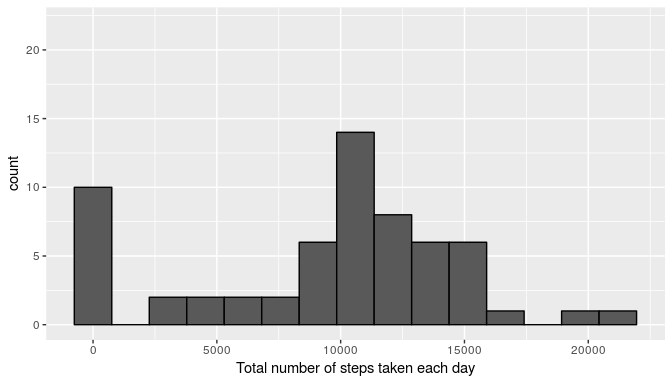
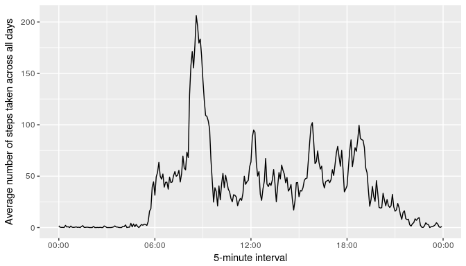
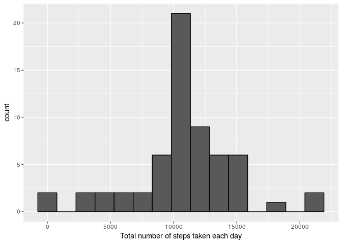
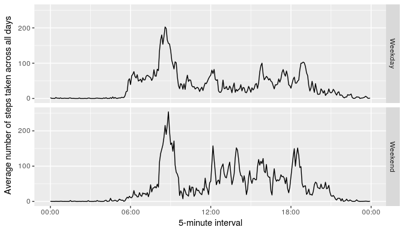

# Reproducible Research: Peer Assessment 1


## Loading and preprocessing the data
Open libraries

```r
library(dplyr)  # Flexible grammar of data manipulation
library(ggplot2) # Graph system
library(lubridate) # Flexible grammar of date-time manipulation
library(xtable)
```

Unzip and read the data:

```r
if(!file.exists("./activity.csv")) unzip("./activity.zip")
activity <- read.csv("activity.csv", stringsAsFactors = FALSE)
```

Then, we convert the date variable to a POSIXct class and create a new date-time variable named `datetime` with information about date and interval.


```r
activity$date <- ymd(activity$date, tz = "UTC") #Convert date to a POSIXct variable

# Separate the components of date/time variables
year <- year(activity$date)
month <- month(activity$date)
day <- day(activity$date)

hourmin <- formatC(activity$interval, width = 4, flag = "0")
hours <- substr(hourmin, 1, 2)
minutes <- substr(hourmin, 3, 4)

activity$datetime <- make_datetime(year, month, day, hours, minutes)
```

## What is mean total number of steps taken per day?

Histogram of the total number of steps taken each day


```r
sumsteps <- activity %>%
    group_by(date) %>%
    summarise(sum = sum(steps, na.rm= TRUE)) %>% 
    mutate(days = wday(date, label = TRUE))

g <- ggplot(sumsteps, aes(sum))
g + geom_histogram(color = "black", bins = 15) +
    xlab("Total number of steps taken each day") +
    ylim(0, 22)
```

<!-- -->

The mean and median total number of steps taken per day:


```r
activity %>%
    mutate(days = wday(date, label = TRUE)) %>%
    group_by(date) %>%
    summarise(sum = sum(steps, na.rm= TRUE)) %>% 
    summarise(mean = mean(sum), median = median(sum)) %>%
    xtable() %>% 
    print(type = "html")
```

<!-- html table generated in R 3.4.0 by xtable 1.8-2 package -->
<!-- Thu Jul  6 18:03:59 2017 -->
<table border=1>
<tr> <th>  </th> <th> mean </th> <th> median </th>  </tr>
  <tr> <td align="right"> 1 </td> <td align="right"> 9354.23 </td> <td align="right"> 10395 </td> </tr>
   </table>

## What is the average daily activity pattern?

1. Make a time series plot (i.e. `type = "l"`) of hte 5-minute interval (x-axis) and the average number of steps taken, averaged across all days (y-axis).

```r
averagedaily <- activity %>%
    mutate(time = strftime(datetime, format = "%H:%M", tz = "UTC")) %>%
    group_by(time) %>%
    summarise(mean = mean(steps, na.rm = TRUE)) %>%
    mutate(time = as.POSIXct(origin + hm(time)))

g <- ggplot(averagedaily, aes(time, mean))
g + geom_line() +
    labs(x = "5-minute interval", y = "Average number of steps taken across all days") +
    scale_x_datetime(date_labels = "%H:%M")
```

<!-- -->

2. Which 5-minute interval, on average across al the days in the dataset, contains the maximum number of steps?

```r
maxaverage <- with(averagedaily, time[which.max(mean)])
strftime(maxaverage, format = "%H:%M", tz = "UTC")
```

```
## [1] "08:35"
```

## Imputing missing values
Calculate and report the total number of missing values in the dataset (i.e. the total number of rows with NAs)

```r
with(activity, sum(is.na(steps)))
```

```
## [1] 2304
```

2. Devise a strategy for filling in all of the missing values in the dataset. The strategy does not need to be sofisticated.

We fill the missin values with the mean for the 5-minutes interval.

3. Create a new dataset that is equal to the original dataset but with the missing data filled in.


```r
fillactivity <- activity

## Define function that compute the total mean per interval
totalmeanperint <- function(x){
    mean(activity$steps[activity$interval == activity$interval[x]], na.rm = TRUE)
}

## Fill NAs with total mean per interval
for(i in seq_along(fillactivity$steps)){
        if(is.na(fillactivity$steps[i])) {
            fillactivity$steps[i] <- totalmeanperint(i)
        }
}
```

4. Make a histogram of the total number of steps taken each day and calculate and report the mean and median total number of steps taken per day.


```r
sumstepsfill <- fillactivity %>%
    group_by(date) %>%
    summarise(sum = sum(steps, na.rm= TRUE)) %>% 
    mutate(days = wday(date, label = TRUE))

g <- ggplot(sumstepsfill, aes(sum))
g + geom_histogram(color = "black", bins = 15) +
    xlab("Total number of steps taken each day")
```

<!-- -->

```r
meanstepsfill <- fillactivity %>%
    mutate(days = wday(date, label = TRUE)) %>%
    group_by(date) %>%
    summarise(sum = sum(steps)) %>% 
    summarise(mean = mean(sum), median = median(sum)) %>% 
    xtable() %>% 
    print(type = "html")
```

<!-- html table generated in R 3.4.0 by xtable 1.8-2 package -->
<!-- Thu Jul  6 18:04:02 2017 -->
<table border=1>
<tr> <th>  </th> <th> mean </th> <th> median </th>  </tr>
  <tr> <td align="right"> 1 </td> <td align="right"> 10766.19 </td> <td align="right"> 10766.19 </td> </tr>
   </table>
  
    
This values differ slightly from the estimates from the first part of the assignment. We can observe in the histogram that the frequencies of lowest class are reduced in the filled data, and the middle class are augmented. Another differences is that the mean and median of the fill data set are equal. The sum of steps per day is now less skewness.


## Are there differences in activity patterns between weekdays and weekends?
  
1. Create a new factor variable in the dataset with two levels - "weekday" and "weekend" indicating whether a given date is a weekday or weekend day.


```r
fillactivity$wday[wday(fillactivity$date) <= 5] <- "Weekday"
fillactivity$wday[wday(fillactivity$date) > 5] <- "Weekend"
```

2. Make a panel plot containing a time series plot (i.e. `type = "l"`) of the 5-minute interval (x-axis) and the average number of steps taken, averaged across all weekday days or weekend days (y-axis).


```r
averagedailyfill <- fillactivity %>%
    mutate(time = strftime(datetime, format = "%H:%M", tz = "UTC")) %>%
    group_by(time, wday) %>%
    summarise(mean = mean(steps)) %>% 
    group_by() %>% 
    mutate(time = as.POSIXct(origin + hm(time)))

    
g <- ggplot(averagedailyfill, aes(time, mean))
g + facet_grid(wday ~ . ) +
    geom_line() +
    labs(x = "5-minute interval", y = "Average number of steps taken across all days") +
    scale_x_datetime(date_labels = "%H:%M")
```

<!-- -->
